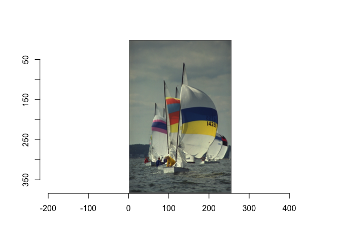

# panizimager

<!-- badges: start -->

[](https://github.com/paradise1260/panizimager/actions)
<!-- badges: end -->

The goal of panizimager is to work with images. For now, it only has a
function called rotate\_image. This function rotates an image
counter-clockwise for a given number of times. You should pass a loaded
image via imager library to the function.

## Installation

You can install the released version of panizimager from
[GitHub](https://github.com/) with:

``` r
# install.packages("devtools")
devtools::install_github("paradise1260/panizimager")
```

## Example

This is a basic example which shows you how to solve a common problem:

``` r
library(panizimager)
library(imager)
#> Loading required package: magrittr
#> 
#> Attaching package: 'imager'
#> The following object is masked from 'package:magrittr':
#> 
#>     add
#> The following objects are masked from 'package:stats':
#> 
#>     convolve, spectrum
#> The following object is masked from 'package:graphics':
#> 
#>     frame
#> The following object is masked from 'package:base':
#> 
#>     save.image
plot(boats)
```



``` r
plot(rotate_image(boats, 3))
```


